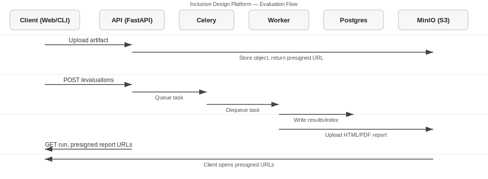

# Inclusive Design Platform (IDP)

[](https://github.com/ORG/REPO/actions/workflows/ci.yml)

> Replace `ORG/REPO` above with your GitHub org/repo to activate the badge link.

Monorepo for IDP. It includes a FastAPI backend with JWT auth, Postgres, Redis, MinIO, Celery worker, a React/Vite web UI, a Python Typer CLI, a FreeCAD add‑on, seeds + a one‑shot demo script, and GitHub Actions CI.

## Contents
- Quick Start (Docker Compose)
- End‑to‑End Demo (one command)
- Fork Demo (one‑click seed)
- Manual Flow (login → project → upload → evaluate → report)
- Web App Usage
- CLI Usage
- FreeCAD Add‑on
- Development (lint, tests, types)
- CI on GitHub
- Troubleshooting
- How It Works (Architecture)
- Evaluation Pipeline (Step‑by‑Step)

## Quick Start (Docker Compose)

1) Prerequisites
- Docker and Docker Compose
- Make
- (Optional) Python 3.11+ if you want to run tests locally

2) Configure environment
- `cp .env.example .env`
- Keep defaults for local dev. Ensure ports 8000 (API) and 3000 (web) are free.

3) Start the dev stack
- `make dev`
- Services started: `api`, `worker`, `web`, `postgres`, `redis`, `minio`.

4) Verify
- API health: `curl http://localhost:8000/api/v1/health` → `{ "status": "ok" }`
- Web UI: http://localhost:3000

Common commands
- `make ps` — show containers
- `make logs` — tail all logs
- `make down` — stop and remove containers/volumes

## End‑to‑End Demo (one command)
Runs migrations, seeds, registers a demo user, uploads a tiny glTF, enqueues an evaluation, waits for completion, generates a report, and prints a presigned PDF URL.

- `make demo`

Output
- The last line is a presigned link (valid temporarily) to the generated PDF report in MinIO. Paste it into a browser to view.

Demo credentials for the web app
- email: `demo@idp.local`
- password: `demo123`

## Fork Demo (one‑click seed)
For forks that want a quick, self‑contained demo inside the app UI.

- Fork this repo on GitHub. Update the README badge to your `ORG/REPO` if desired.
- Local setup: `cp .env.example .env` then `make dev`.
- Create a user (UI has login only). Register via API:
  - `curl -sX POST http://localhost:8000/auth/register -H 'Content-Type: application/json' -d '{"email":"you@example.com","password":"secret"}'`
- Open http://localhost:3000 and log in with that email/password.
- Go to Projects and click “Run Demo”. This will:
  - Create a Demo Project in your org
  - Upload the sample glTF to MinIO
  - Create a Demo Scenario and a RulePack (if missing)
  - Enqueue an evaluation and navigate to its page

API alternative
- You can also seed directly via API (requires JWT in `Authorization: Bearer <token>`):
  - `curl -sX POST http://localhost:8000/api/v1/demo/seed -H "Authorization: Bearer $TOKEN" | jq .`
  - Get a token: `curl -s -X POST http://localhost:8000/auth/token -d 'username=you@example.com&password=secret' -H 'Content-Type: application/x-www-form-urlencoded' | jq -r .access_token`

## Manual Flow (API)
If you want to drive the flow yourself with curl.

1) Register and login
```bash
# Register (will auto‑create a default org if needed)
curl -sX POST http://localhost:8000/auth/register \
  -H 'Content-Type: application/json' \
  -d '{"email":"you@example.com","password":"secret"}'
# Login
TOKEN=$(curl -s -X POST http://localhost:8000/auth/token \
  -H 'Content-Type: application/x-www-form-urlencoded' \
  -d 'username=you@example.com&password=secret' | jq -r .access_token)
AUTH="Authorization: Bearer $TOKEN"
```

2) Create a project
```bash
curl -sX POST http://localhost:8000/api/v1/projects \
  -H "$AUTH" -H 'Content-Type: application/json' \
  -d '{"name":"My Project"}' | tee /tmp/proj.json
PROJ_ID=$(jq -r .id /tmp/proj.json)
```

3) Upload an artifact (glTF + optional param JSON)
```bash
curl -sX POST http://localhost:8000/api/v1/projects/$PROJ_ID/artifacts \
  -H "$AUTH" \
  -F file=@api/seeds/minimal.gltf \
  -F params=@<(echo '{"demo":true}') | tee /tmp/art.json
ART_ID=$(jq -r .id /tmp/art.json)
```

4) Create a scenario and rulepack
- The demo creates a simple scenario in the DB (see `api/scripts/demo.py`). For manual API only, you can insert a scenario directly via DB or add an endpoint later.
- Use the seeded “General EU v1” rulepack or create your own via `/api/v1/rulepacks`.

5) Enqueue evaluation
```bash
RUN=$(curl -sX POST http://localhost:8000/api/v1/evaluations \
  -H "$AUTH" -H 'Content-Type: application/json' \
  -d '{"artifact_id":'"$ART_ID"',"scenario_id":1,"rulepack_id":1}')
RUN_ID=$(echo "$RUN" | jq -r .id)
```

6) Poll for completion
```bash
curl -s http://localhost:8000/api/v1/evaluations/$RUN_ID -H "$AUTH" | jq .
```

7) Generate report and open link
```bash
curl -sX POST http://localhost:8000/api/v1/evaluations/$RUN_ID/report -H "$AUTH" | jq .
```

Tip: Use the CLI below to submit/wait/fetch easily.

## Web App Usage
- Go to http://localhost:3000
- Log in (demo credentials above or your own).
- Projects page: create a project; open a project.
- Artifacts page: `#/projects/:id/artifacts` — drag & drop glTF/GLB/STEP and optional params JSON, then enqueue an evaluation (enter scenario + rulepack IDs).
- Evaluation page: `#/evaluations/:id` — 3D viewer (glTF), toggle reach envelope, see per‑rule breakdown and Inclusivity Index. “Recompute” enqueues a new run.

Accessibility
- Viewer supports keyboard focus; controls are labeled; ARIA attributes added on key widgets.

## CLI Usage (Typer)
Run locally or inside the api container.

Configure
```bash
python -m api.cli.idp login --base-url http://localhost:8000
# You’ll be prompted for the JWT token (from /auth/token)
```

Submit, wait, and fetch report
```bash
python -m api.cli.idp eval submit --artifact 1 --scenario 1 --rulepack 1 --json | jq .
python -m api.cli.idp eval wait --id 123
python -m api.cli.idp report fetch --id 123 --out reports/
```

Datasets
```bash
python -m api.cli.idp datasets list --json | jq .
```

Tokens are stored in your user config dir (created if missing):
- Linux: `~/.config/idp-cli/config.json`
- macOS: `~/Library/Application Support/idp-cli/config.json`
- Windows: `%APPDATA%\idp-cli\config.json`

## FreeCAD Add‑on
Path: `plugin/freecad`

Install
- Copy `plugin/freecad` to your FreeCAD `Mod/` folder:
  - Linux: `~/.local/share/FreeCAD/Mod/idp_freecad`
  - macOS: `~/Library/Preferences/FreeCAD/Mod/idp_freecad`
  - Windows: `%APPDATA%/FreeCAD/Mod/idp_freecad`
- Restart FreeCAD → Tools → IDP → Export & Upload.

Use
- Set API URL and JWT token; enter a Project ID; click “Export & Upload”.
- The add‑on exports STEP from the active document and uploads parametric JSON metadata.

Tests
- `python -m pytest plugin/freecad/tests -q`

## Development

Lint/format
```bash
pip install pre-commit
make pre-commit-install
make fmt
make lint
```

Tests & types (API)
```bash
cd api
pip install -r requirements.txt
pytest -q
mypy app || true
```

## CI on GitHub
- Workflow: `.github/workflows/ci.yml`
- Runs: pre-commit, mypy, pytest, and builds Docker images.
- Enable Actions in your repo; update the README badge to your `ORG/REPO`.

## Troubleshooting
- Entry script permission error on api: compose runs with `sh /app/entrypoint.sh` to avoid exec bit issues.
- Migrations failing: `make logs` (api service) and ensure Postgres is up; rerun `make dev`.
- Presigned URLs expire: re‑POST `/evaluations/{id}/report`.
- MinIO console: http://localhost:9001 (default creds in `.env.example`).
- Worker must be running for evaluations to complete.
- Bootstrap superadmin (dev only): set `BOOTSTRAP_SUPERADMIN_SECRET` in `.env`, rebuild, then:
  - `curl -sX POST http://localhost:8000/api/v1/admin/bootstrap_superadmin -H 'Content-Type: application/json' -d '{"email":"you@example.com","secret":"<your-secret>"}' | jq .`
  - Remove the secret from `.env` after promoting to avoid misuse.

## Repository Layout
```
api/            # FastAPI app, Alembic, Celery tasks, CLI
web/            # React + Vite web app
plugin/freecad/ # FreeCAD add-on (PySide UI)
docs/           # SECURITY.md and future docs
.github/        # CI
```

## License
MIT

## How It Works (Architecture)
- Backend API: FastAPI app (`api/app/main.py`) with JWT auth, org scoping, RBAC, and CRUD for projects, artifacts, scenarios, rule packs, evaluations, reports.
- Worker: Celery worker (`api/app/celery_app.py`) using Redis (broker + backend). Runs asynchronous tasks like `app.tasks.run_evaluation` and a stub `convert_artifact`.
- Database: Postgres holds orgs, users, projects, artifacts, scenarios, rule packs, evaluation runs, reports (see `api/app/models.py`).
- Object Storage: MinIO (S3‑compatible). Artifacts and generated reports are stored via S3 APIs (`api/app/storage.py`), with presigned GET/PUT URLs for the web/CLI.
- Web UI: React + Vite app (`web/`) consuming the API and S3 presigned URLs for viewing models and reports.
- Datasets/Rules: JSON rule packs and demo data live in `api/data` and are persisted under `api/app/persistence.py` when created/updated.

Key data entities
- Organization/Users: Users belong to an org and have roles (e.g., `designer`, `researcher`, `org_admin`, optional `superadmin`).
- Project: Container for artifacts, scenarios, evaluations, and reports; belongs to an org.
- DesignArtifact: A design file (e.g., GLTF/GLB/STEP) stored in MinIO, with an `object_key` and optional parameters JSON.
- SimulationScenario: Parameters for evaluation (e.g., posture, distances, forces, colors) stored as JSON `config`.
- RulePack: Versioned set of rules with safe boolean expressions that evaluate against provided variables.
- EvaluationRun: A queued/run/finished job holding computed `results_json` and `inclusivity_index_json`.
- Report: Rendered HTML/PDF report stored in MinIO with a checksum and presigned URLs.

Security & access
- Auth: JWT token from `/auth/token`; registration via `/auth/register` (dev/demo).
- Org scope: Non‑superadmin users can only access projects within their org. Endpoints enforce org checks.
- Roles: Upload/delete artifacts and create scenarios require editor roles; enqueue evaluations allowed for `org_admin`/`researcher`/`designer`; destructive actions are restricted.

## Evaluation Pipeline (Step‑by‑Step)


1) Upload artifact
- Endpoint: `POST /api/v1/projects/{project_id}/artifacts`
- Stores content in MinIO at `projects/{project}/artifacts/...` and returns DB record + presigned GET URL. Optional `presign=true` supports browser‑side upload via presigned PUT.

2) Create scenario and choose rule pack
- Scenario: `POST /api/v1/scenarios` with `config` fields used by simulations:
  - `distance_to_control_cm`, `posture` ("seated"|"standing"), `required_force_N`, `capability_N`, `fg_rgb`, `bg_rgb`, optional `button_w_mm`, `button_h_mm`.
- Rule pack: `POST /api/v1/rulepacks` or pick an existing one; JSON contains `rules[]` with thresholds and a boolean `condition`.

3) Enqueue an evaluation
- Endpoint: `POST /api/v1/evaluations` with `{ artifact_id, scenario_id, rulepack_id, webhook_url? }`.
- API validates references, org scope, and role, then creates an `evaluation_runs` row with `status=queued` and schedules the Celery task `app.tasks.run_evaluation(run.id)`.

4) Worker executes the evaluation (Celery)
- Task: `app.tasks.run_evaluation` loads the run, scenario, rule pack, and artifact.
- Simulations (`api/app/simulations.py`):
  - Reach: `reach_envelope_ok(distance_cm, posture)` → seated ≤ 60cm, standing ≤ 75cm.
  - Strength: `strength_feasible(required_force_N, capability_N)` → capability ≥ required.
  - Visual: `wcag_contrast_from_rgb(fg_rgb, bg_rgb)` → passes if contrast ≥ 4.5.
- Rule evaluation (`api/app/rules.py`):
  - Each rule defines thresholds and a safe expression `condition` (AST‑validated; no calls/attrs). Variables combine scenario inputs + thresholds (e.g., `w`, `h`, `min_mm`).
  - `evaluate_rule` returns `{id, passed, severity}` for each rule; results aggregated under `results.rules`.
- Inclusivity Index: `inclusivity_index(reach_ok, strength_ok, visual_ok)` weights reach 0.4, strength 0.3, visual 0.3, producing `score` in [0,1] and `components` booleans.
- Persistence: The worker sets `status=done`, `completed_at`, and stores `results_json` and `inclusivity_index_json` on the run.
- Optional webhook: If `webhook_url` was provided and `WEBHOOK_SECRET` is set, the worker POSTs `{id, status, results, index}` with header `X-IDP-Webhook`.

5) Retrieve evaluation results
- Endpoint: `GET /api/v1/evaluations/{id}` returns `status`, `metrics`, `results`, and `inclusivity_index` for polling UIs/CLIs.

6) Generate a report
- Endpoint: `POST /api/v1/evaluations/{id}/report` (requires `status=done`).
- Rendering (`api/app/reporting.py`): Jinja2 HTML template with Inclusivity Index, rule outcomes, and change vs previous run. PDF via WeasyPrint if available; otherwise HTML bytes fallback.
- Storage: Uploads HTML/PDF to MinIO at `projects/{project_id}/reports/{run.id}.html|.pdf`. A `reports` row is created and API returns presigned GET URLs for both.

7) Optional conversion (STEP → glTF stub)
- Task: `app.tasks.convert_artifact(artifact_id)` creates a minimal glTF placeholder and updates the artifact record; useful when STEP uploads need a quick viewer stub.

Notes
- Presigned URLs use the public S3 endpoint (`S3_PUBLIC_ENDPOINT_URL` if set) for browser access.
- Rule expressions are sandboxed (AST‑based) and accept only numeric/boolean ops; no function calls or attribute access.
- All endpoints enforce org scope; `superadmin` bypasses org checks for administration/testing.
